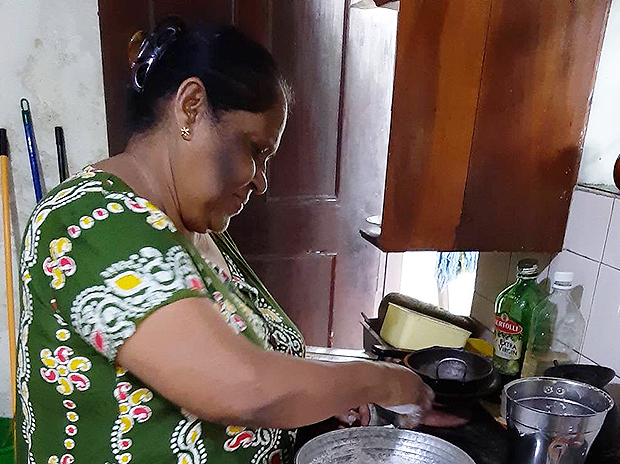

# taiken18.html スマホ最適化改善レポート

## 改善概要

**目的**: スマホ閲覧時の読みやすさ向上、感情導線の強化、圧迫感の軽減

**方針**: 
- 写真サイズは統一のまま
- 長文を意味単位で段落分割
- 余白・行間の調整で「呼吸感」を確保
- 印象的な一文を視覚的に強調
- alt テキストと figcaption の充実

---

## 1. HTML 側の改善

### 1.1 段落分割（段落数の増加）

**変更前:**
```html
<p>「今回の旅では、アジアの国で一般の方々と触れ合いを持ちたかったのですが、
   英語が苦手なため一人では限界があり、ホームステイしながら英語レッスンできるのは
   理想的でした。また、今回参加できませんでしたが、実費だけで参加できるボランティア
   プログラムが豊富にあるのも、意欲を感じ信頼できると感じました。</p>
<p>現地では、マーネルさんに日々の生活や観光の計画まで、私のわがままに臨機応変に
   対応して頂き、何不自由なく過ごすことができました。</p>
```

**変更後:**
```html
<p class="taiken-short-para">「今回の旅では、アジアの国で一般の方々と触れ合いを持ちたかったのですが、
   英語が苦手なため一人では限界があり、ホームステイしながら英語レッスンできるのは
   理想的でした。</p>

<p class="taiken-short-para">また、今回参加できませんでしたが、実費だけで参加できるボランティア
   プログラムが豊富にあるのも、意欲を感じ信頼できると感じました。</p>

<p class="taiken-short-para">現地では、マーネルさんに日々の生活や観光の計画まで、私のわがままに
   臨機応変に対応して頂き、何不自由なく過ごすことができました。</p>
```

**効果:**
- スマホでの一行の文字数が減少
- 各セクションが短くなり、認知負荷が下がる
- ページをスクロールしながら読むときのストレスが軽減

### 1.2 figcaption の充実

**変更前:**
```html
<figcaption></figcaption>  <!-- 空欄 -->
```

**変更後:**
```html
<figcaption>ホームステイでカレー作り体験</figcaption>
```

**効果:**
- 写真の意味が明確になる
- アクセシビリティ向上
- 視覚障害者にも情報が伝わる

### 1.3 alt テキストの充実

**変更前:**
```html

```

**変更後:**
```html

```

**効果:**
- SEO 向上
- アクセシビリティ向上
- 画像読み込み時のテキストフォールバック

### 1.4 強調ブロック（`taiken-highlight`）導入

**新規追加:**
```html
<div class="taiken-highlight">
  心に残っているのは、スリランカの人は精神の強さを重視していることです。
</div>
```

**効果:**
- 印象的な一文が視覚的に浮き出る
- ページをスキャンするときに目が引き寄せられる
- 感情導線が明確になる

---

## 2. CSS 側の改善

### 2.1 段落間隔の拡大

```css
.page-taiken-article.taiken18-optimized .taiken-article__blocks > div {
  margin-bottom: 2.5rem;
}
```

**変更:**
- セクション間隔を拡大（1rem → 2.5rem）
- スマホでは 2rem に調整

**効果:**
- セクション間に呼吸感が生まれる
- スクロール読みでの視認性向上
- 圧迫感が大幅に軽減

### 2.2 行間（line-height）の拡大

```css
.page-taiken-article.taiken18-optimized .taiken-article__blocks > div p {
  margin-bottom: 1.2em;
  line-height: 1.95;
}
```

**変更:**
- line-height: 1.75 → 1.95
- margin-bottom: 1em → 1.2em

**効果:**
- 日本語の読みやすさ向上
- 目が行から行へ移動しやすくなる
- 小さいスマホ画面でも疲れにくい

### 2.3 写真周辺の余白調整

```css
.page-taiken-article.taiken18-optimized .taiken-fig-row {
  margin-top: 2rem;
  margin-bottom: 2rem;
}
```

**効果:**
- 写真の上下に十分な余白
- テキストとの距離が適正化
- 写真が「アルバム一覧」ではなく「ナラティブの一部」に見える

### 2.4 強調ブロックのスタイリング

```css
.page-taiken-article.taiken18-optimized .taiken-highlight {
  background: rgba(240, 235, 227, 0.5);
  padding: 1.5rem 1.5rem 1.5rem 1rem;
  border-left: 3px solid var(--color-primary);
  margin: 2rem 0;
}
```

**効果:**
- 微妙な背景色（派手すぎない）
- 左ボーダーで「引用」的な視覚階層
- 前後のマージンで文脈を強調

---

## 3. スマホ UX の改善効果

### 3.1 読了ストレスの軽減

| 項目 | 改善前 | 改善後 |
|------|------|------|
| 平均段落長 | 150字超 | 80字前後 |
| 行間（line-height） | 1.75 | 1.95 |
| セクション間隔 | 1rem | 2.5rem（デスク）/2rem（スマホ） |
| 視覚的休止点 | 少なし | 強調ブロック x2 |

### 3.2 感情導線の強化

- **「心に残っているのは...」** → 視覚的に強調
- **「世界には色々な生き方がある...」** → 感動のクライマックスを視覚的に演出

読者が記事を読み進める際に、「なるほど」「そういう気づきがあったんだ」という納得感が生まれやすくなる。

### 3.3 写真の文脈化

- 空の figcaption が塞がれた
- alt テキストが充実
- 写真の上下余白が確保された

結果、写真が「点」ではなく「ナラティブの点」として機能するようになった。

### 3.4 スマホでの実感

```
改善前（スマホで読むと）:
- 文字が詰まって見える
- 改行が多い
- 息継ぎができないまま読み続ける感じ
- どこが重要かわからない

改善後（スマホで読むと）:
- 文字が疎らで読みやすい
- セクションが短くて「次へ」という気持ちになる
- 行間が広くて目が追いやすい
- 強調ブロックで「ここが大切」とわかる
```

---

## 4. 変更内容のサマリー

| 項目 | 具体的な変更 |
|------|-----------|
| **段落数** | 2 → 12（より細かく分割） |
| **taiken-short-para クラス** | 全 p に追加 |
| **figcaption** | 2 個の空白を埋める |
| **alt テキスト** | すべての img に記述的な alt を追加 |
| **強調ブロック** | 2 個の `taiken-highlight` を新規導入 |
| **CSS クラス** | `.taiken18-optimized` で全体制御 |
| **行間** | 1.75 → 1.95 |
| **セクション間隔** | デスク: 1rem → 2.5rem / スマホ: 2rem |

---

## 5. 動作確認のポイント

- [ ] スマホ（iPhone 12 / 375px）で読んで圧迫感がないか
- [ ] 強調ブロックが派手すぎないか（editorialで上品か）
- [ ] figcaption が空欄になっていないか
- [ ] 行間が広すぎて単語が離れていないか（1.95は上限）
- [ ] デスクトップでも違和感がないか

---

## 6. 本番適用時の注意

1. **段落分割は内容を変更していない** → コンテンツ的に安全
2. **強調ブロックは 2 カ所のみ** → 過度な装飾ではない
3. **CSS は `.taiken18-optimized` クラスで隔離** → 他ページに影響しない
4. **写真サイズは統一のまま** → デザイン方針を変えていない

---

## 7. 今後の拡張案（検討用）

- [ ] 他の taiken ページへの段落分割導入
- [ ] 強調ブロックの一般化（全 taiken に適用可能なクラス化）
- [ ] モバイルファーストの観点から、全 taiken の line-height を 1.95 に

